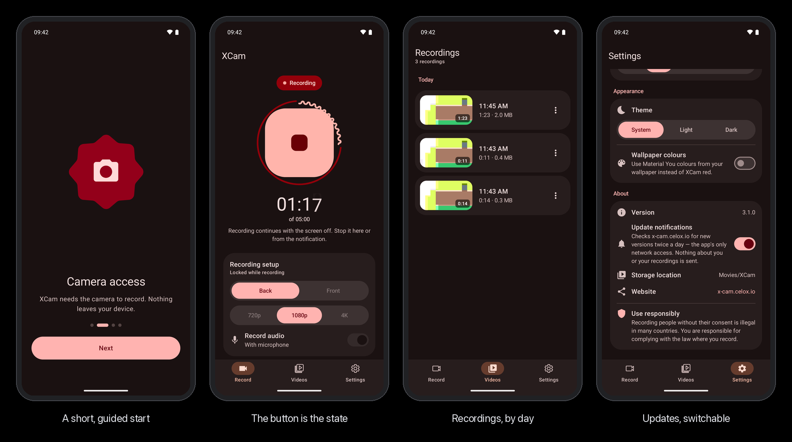

<div align="center">

<a href="https://x-cam.celox.io"></a>

# 🎥 XCam

**Record video with the screen off — a free, open-source Android app. Tap once, lock the phone, and XCam keeps recording until you stop it.**

<p>
  <a href="https://x-cam.celox.io"></a>
  &nbsp;
  <a href="https://x-cam.celox.io/download"></a>
</p>

<h3>👉 <a href="https://x-cam.celox.io">x-cam.celox.io</a> — features, install guide, FAQ and always the newest APK</h3>

<!-- Headline badges — ReadmeBadgesTest keeps version, test count and line counts true. -->
[](https://github.com/pepperonas/XCam/releases/latest)
[](#-testing)
[](app/src/main/java/io/celox/xcam)
[](app/src/test/java/io/celox/xcam)

<!-- Project status — live GitHub badges. -->
[](https://github.com/pepperonas/XCam/actions/workflows/ci.yml)
[](https://github.com/pepperonas/XCam/actions/workflows/release.yml)
[](https://github.com/pepperonas/XCam/releases/latest)
[](https://github.com/pepperonas/XCam/releases/latest)
[](https://github.com/pepperonas/XCam/releases)
[](https://github.com/pepperonas/XCam/commits/main)
[](https://github.com/pepperonas/XCam/commits/main)
[](https://github.com/pepperonas/XCam)
[](https://github.com/pepperonas/XCam)
[](https://kotlinlang.org)
[](https://github.com/pepperonas/XCam/issues)
[](https://github.com/pepperonas/XCam/stargazers)
[](https://github.com/pepperonas/XCam/network/members)

<!-- Platform & build — ReadmeBadgesTest checks the SDK, JDK, ABI and APK-size badges against the build. -->
[](https://developer.android.com)
[](https://apilevels.com)
[](https://apilevels.com)
[](app/build.gradle.kts)
[](https://adoptium.net)
[](#-download)
[](https://github.com/pepperonas/XCam/releases/latest)
[](https://kotlinlang.org)
[](https://developer.android.com/jetpack/compose)
[](https://m3.material.io/blog/m3-expressive-motion-theming)
[](https://developer.android.com/media/camera/camerax)
[](https://developer.android.com/media/media3)
[](https://developer.android.com/topic/libraries/architecture/workmanager)
[](app/src/main/res)
[](#-privacy)
[](CHANGELOG.md)
[](LICENSE)
[](https://celox.io)

[](https://www.paypal.com/donate/?business=martin.pfeffer@celox.io&currency_code=EUR&item_name=XCam)

</div>

---

> [!IMPORTANT]
> **Record responsibly.** Recording people without their consent is illegal in many countries. XCam is
> meant for your own security and documentation — you are responsible for complying with the law where
> you record. See [Legal & responsible use](#%EF%B8%8F-legal--responsible-use).

## 📸 Screenshots



<sub>Material 3 **Expressive**: the record button morphs on a spring from a nine-lobed shape into a stop square, a wavy ring shows the time limit, timer digits roll, and the whole app follows light and dark theme — optionally in your wallpaper colours. The strip is built from raw captures with `python3 tools/mockups.py`.</sub>

## ✨ Features

- **Keeps recording with the screen off** — a camera + microphone foreground service with its own wake
  lock. Lock the phone, put it in your pocket; the camera runs until you stop it.
- **One button that is its state** — idle it is a slowly turning nine-lobed shape; tap it and it morphs
  into a stop square. What the screen shows comes from CameraX's own events (`Start`, `Finalize`), never
  from a guess — a stop from the notification, the time limit or a camera error show up as they happen.
- **Stop from anywhere, or automatically** — in the app, from the notification, or by itself after 5,
  15, 30 or 60 minutes (enforced by CameraX); a ring around the button fills as the time runs.
- **Straight into your gallery** — MP4 files in `Movies/XCam`, listed by day with thumbnail, length and
  size; share or delete one or several at once (long press); built-in player with share and delete.
- **Both cameras at once** — on phones that let apps run two cameras together, *Both* records the
  back camera full frame with the front camera as a small inset, in one video (up to 720p). The
  option only appears where the phone supports it; Settings says whether yours does.
- **Your camera, your quality** — back or front, 720p / 1080p / 4K, with or without sound; if a lens
  cannot do the chosen size XCam steps down instead of failing. All settings are saved.
- **Tells you about updates** — a notification (once per release) and a hint in the app when a new
  version is out; a tap opens the website with the download. Switchable in Settings.
- **Back navigation that behaves** — back goes player → tab → Record → out, and the predictive back
  gesture shows where you land before you let go.
- **Material 3 Expressive** — spring physics everywhere, light and dark theme, optional wallpaper
  colours (Material You), themed app icon, semantic haptics, reduced-motion support.
- **English and German**, following the system or the per-app language setting.

## 📥 Download

**[x-cam.celox.io](https://x-cam.celox.io)** always offers the newest signed APK, served as a verified,
resumable copy from the site itself — or grab it from
[GitHub Releases](https://github.com/pepperonas/XCam/releases/latest).

| | |
|---|---|
| Requires | Android 13 or newer, 64-bit ARM (`arm64-v8a`) |
| File | `xcam-vX.Y.Z.apk` — one file for every supported phone |
| Signing certificate SHA-256 | `78f163f0bfcff57e2e7d3212dee8aedb1d3bfdf48ce4c1512bf7801955a1cf38` |
| Checksum | `SHA256SUMS.txt` in every release, and on the website |

```bash
apksigner verify --print-certs xcam-v3.2.0.apk | grep SHA-256   # must print the digest above
sha256sum -c SHA256SUMS.txt
```

**Coming from 2.x?** Version 3.0.0 switched to its own signing key, so uninstall the old app once. Your
recordings stay in `Movies/XCam`; in the Videos tab, *Allow* lets XCam list them again. Every release
from 3.0.0 on installs over the previous one.

## 🔒 Privacy

- Recordings are **never uploaded** — they are MP4 files on your phone and nothing else.
- The **only** network access is the update check: twice a day XCam fetches
  `https://x-cam.celox.io/latest.json` (GitHub's release API as the fallback). Nothing about you or your
  recordings is sent. Switch it off in *Settings → About → Update notifications*.
- No account, no ads, no analytics. `NetworkPolicyTest` pins this to the code: the app's sources may
  name no other host, and no plain `http://`.

## 🏛️ Architecture

MVVM with Jetpack Compose, no DI framework — one `RecordingViewModel` shared by all screens.

```
RecordingService (LifecycleService, camera|microphone FGS, wake lock)
   │  CameraX VideoRecordEvent.Start / Finalize
   ▼
RecordingRepository  ── StateFlow<RecordingState> ──►  RecordingViewModel  ──►  Compose UI
                                                          ▲        ▲
PreferencesManager (DataStore: settings, update state) ───┘        │
VideoRepository (MediaStore Movies/XCam, ContentObserver) ─────────┘
UpdateWatcher (WorkManager, 12 h) → UpdateChecker → UpdateNotifier
```

- **The service is the single source of truth** for the recording state; the UI never guesses.
- **Navigation:** onboarding runs *before* the app, not inside its navigation graph, so Record is the one
  fixed root; the player only navigates while it is the resumed screen.
- **Design system:** `MaterialExpressiveTheme` + `MotionScheme.expressive()`; colours generated from the
  seed `#E5484D` (`tools/color-scheme.mjs`); shape morphing with `graphics-shapes`; icons are Material
  path data (`XIcons`) instead of the 10 MB icons-extended artifact.

Details for contributors: [CLAUDE.md](CLAUDE.md).

**Tech stack:** Kotlin 2.0 · Jetpack Compose 1.11 · Material 3 1.5 (Expressive) · CameraX 1.4 ·
Media3 ExoPlayer · Coil (video frames) · DataStore · WorkManager · Navigation Compose 2.9 · Robolectric.

## 🛠️ Build

```bash
./gradlew assembleDebug           # debug APK
./gradlew installDebug            # build and install on a connected device
./gradlew testDebugUnitTest       # unit tests
./gradlew lintDebug               # Android lint (CI: 0 errors)
./gradlew assembleRelease         # signed release APK (needs keystore.properties + release.jks)
```

JDK 17. Compose and Material 3 are pinned (no BOM) because the Expressive APIs live in the material3
1.5.0 alpha line — see `gradle/libs.versions.toml`. R8 needs a 6 GB Gradle heap (`gradle.properties`);
on a busy machine add `--max-workers=1`.

## 🚀 Releases

```bash
# 1. app/build.gradle.kts — bump versionCode and versionName
# 2. CHANGELOG.md         — add "## [x.y.z] - YYYY-MM-DD" (it becomes the release notes)
# 3. README.md            — the version, test-count and size badges (ReadmeBadgesTest fails if they drift)
git tag vX.Y.Z && git push origin vX.Y.Z
```

The release workflow checks the tag against `versionName`, runs the tests, builds and signs the APK,
**verifies the signing certificate** and publishes `xcam-vX.Y.Z.apk` with `SHA256SUMS.txt`. The website
picks the release up within 15 minutes by itself, and installed apps announce it.

## 🧪 Testing

208 JVM unit tests (JUnit + Robolectric), run on every push by CI:

| Area | What is pinned |
|---|---|
| Both cameras | the front+back pair is found in the device's concurrent combinations, the inset stays inside the frame, dual recordings are capped at 720p, a saved choice falls back to the back camera where unsupported |
| Recording state | `RecordingRepository` transitions in every order the service can report them, a second start is refused, errors stay visible |
| Service & notification | the start intent carries the whole config, a busy start sends nothing, the notification's stop reaches the service and nothing else does |
| Settings | `ConfigPrefs` round trip, unknown or out-of-range values fall back, update settings |
| Updates | version comparison (numeric, suffixes, 4 parts, symmetry), one notification per release, parsers for the site JSON and GitHub incl. error bodies and JSON `null`, https-only links, the posted notification and where its tap leads |
| Videos | day grouping across midnight, year end and the DST night, sizes and durations, Latin digits in every locale, sharing grants read access to every file |
| Design | WCAG AA contrast of every text/colour pair in both schemes, spacing and size scales, semantic haptics with the Android 13 fallback, every icon builds |
| Resources & manifest | every English string has a German one with the same format arguments, plurals complete, the launcher icon stays in the safe zone; service and receiver not exported, foreground types camera + microphone, no storage permission |
| Docs & release | README badges match the build, CHANGELOG headings, dates and versions are well-formed, the signing certificate is the same everywhere |
| Privacy | the app's sources name no host besides the update check, no plain http, no location/contacts permissions |

```bash
./gradlew testDebugUnitTest --tests "io.celox.xcam.docs.ReadmeBadgesTest"   # one class
```

## 📝 Changelog

See [CHANGELOG.md](CHANGELOG.md) — it is also the text of every GitHub release.

## ⚖️ Legal & responsible use

Recording people without their consent is illegal in many countries, and so is recording in many private
or protected places. XCam is a tool for your own security and documentation. You alone are responsible
for how and where you use it.

## 📄 License

[MIT](LICENSE) © Martin Pfeffer · [celox.io](https://celox.io)
