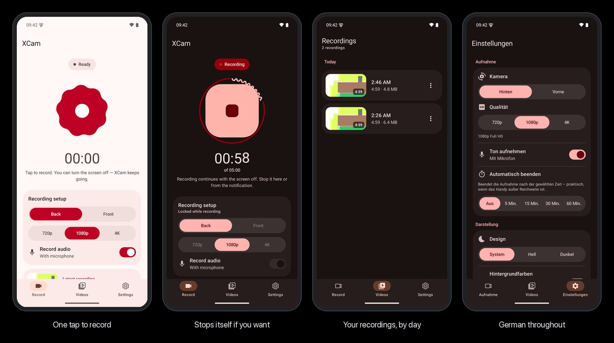

<div align="center">

<a href="https://x-cam.celox.io"></a>

# XCam

**Record video with the screen off — a free, open-source Android app.**

<p>
  <a href="https://x-cam.celox.io"></a>
  &nbsp;
  <a href="https://x-cam.celox.io/download"></a>
</p>

<h3>👉 <a href="https://x-cam.celox.io">x-cam.celox.io</a> — features, install guide, FAQ and always the newest APK</h3>

[](https://github.com/pepperonas/XCam/releases/latest)
[](app/src/test)
[](app/src/main/java)

[](https://github.com/pepperonas/XCam/actions/workflows/ci.yml)
[](https://github.com/pepperonas/XCam/actions/workflows/release.yml)
[](#-download)
[](#-download)
[](app/src/main/res)
[](https://kotlinlang.org)
[](https://developer.android.com/jetpack/compose)
[](https://m3.material.io/blog/m3-expressive-motion-theming)
[](app/build.gradle.kts)
[](app/build.gradle.kts)
[](CHANGELOG.md)
[](LICENSE)

</div>

---

<p align="center"></p>

## ✨ Features

- **Keeps recording with the screen off** — a camera + microphone foreground service with its own wake lock.
- **One button that is its state** — idle it is a slowly turning nine-lobed shape; tap it and it morphs
  (on a spring) into a stop square. The state on screen comes from CameraX's own events, not a guess.
- **Stop from anywhere** — in the app, from the notification, or automatically after 5, 15, 30 or 60
  minutes; a wavy ring around the button shows the time running.
- **Straight into your gallery** — MP4 files in `Movies/XCam`, listed by day with thumbnail, length and
  size; share or delete one or several at once; built-in player.
- **Your camera, your quality** — back or front, 720p / 1080p / 4K, with or without sound; steps down
  instead of failing if a lens cannot do the chosen size. Settings are saved.
- **Nothing leaves your phone** — XCam requests no internet permission. No account, no ads, no analytics.
- **Material 3 Expressive** — spring physics everywhere, light and dark theme, optional wallpaper colours,
  English and German.

## ⬇️ Download

**[x-cam.celox.io](https://x-cam.celox.io)** always offers the newest signed APK with its SHA-256
checksum — or grab it from [GitHub Releases](https://github.com/pepperonas/XCam/releases/latest).

- Android 13 or newer, 64-bit ARM.
- Signing certificate SHA-256:
  `78f163f0bfcff57e2e7d3212dee8aedb1d3bfdf48ce4c1512bf7801955a1cf38`
  (check with `apksigner verify --print-certs xcam-v3.0.0.apk`).
- **Coming from 2.x?** Version 3.0.0 is signed with a new key, so uninstall the old app once. Your
  recordings stay in `Movies/XCam`; in the Videos tab, *Allow* lets XCam list them again.

## 🛠️ Build

```bash
./gradlew assembleDebug           # debug APK
./gradlew testDebugUnitTest       # unit tests
./gradlew lintDebug               # Android lint (CI: 0 errors)
./gradlew assembleRelease         # signed release APK (needs keystore.properties + release.jks)
```

JDK 17. The Compose/Material 3 versions are pinned (no BOM) because the Expressive APIs live in the
material3 1.5.0 alpha line — see `gradle/libs.versions.toml`. R8 needs a 6 GB Gradle heap
(`gradle.properties`).

## 🚀 Releasing

1. Bump `versionCode` and `versionName` in `app/build.gradle.kts`.
2. Add a `## [x.y.z] - date` section to [CHANGELOG.md](CHANGELOG.md) — it becomes the release notes.
3. `git tag vX.Y.Z && git push origin vX.Y.Z` — the release workflow runs the tests, builds and signs the
   APK, verifies the certificate and publishes it. The website picks up the new release within 15 minutes.

## 🧱 Architecture

MVVM with Jetpack Compose, no DI framework. `RecordingService` (a `LifecycleService`) is the only writer
of `RecordingRepository`, a process-wide `StateFlow` the UI observes; settings live in DataStore,
recordings in MediaStore. Details: [CLAUDE.md](CLAUDE.md) and [ARCHITECTURE.md](ARCHITECTURE.md).

## ⚖️ Use responsibly

Recording people without their consent is illegal in many countries. XCam is meant for your own security
and documentation — you are responsible for complying with the law where you record.

## 📄 License

[MIT](LICENSE) © Martin Pfeffer · [celox.io](https://celox.io)
